# Duct User Guide

This brief guide will explain how to use `duct` to annotate your data. The concept and objective of the project are [described in supplemental notes on t he site itself](https://utz.icm.jhu.edu/duct/docs). The site is currently hosted at [`https://utz.icm.jhu.edu/duct`](https://utz.icm.jhu.edu/duct).

## 1. Login

If you currently have an account on `utz`, you should use the following method. Visit [`https://utz.icm.jhu.edu/duct`](https://utz.icm.jhu.edu/duct) and click the `Backdoor` link at the bottom of the page pictured below.

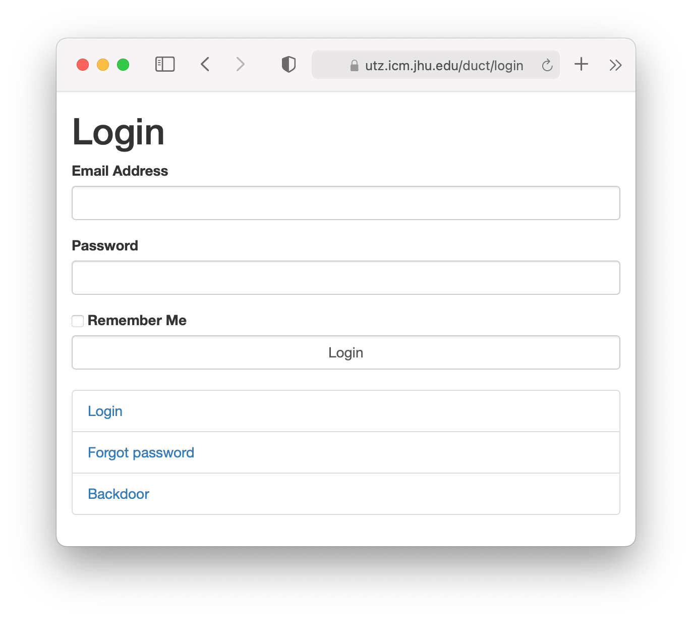

Use your University username and current password (the same as your credentials for logging into Utz, i.e. your JHED ID and associated password). If you can login to `utz` via `ssh` then this login will work. If not, get in touch with the admin.

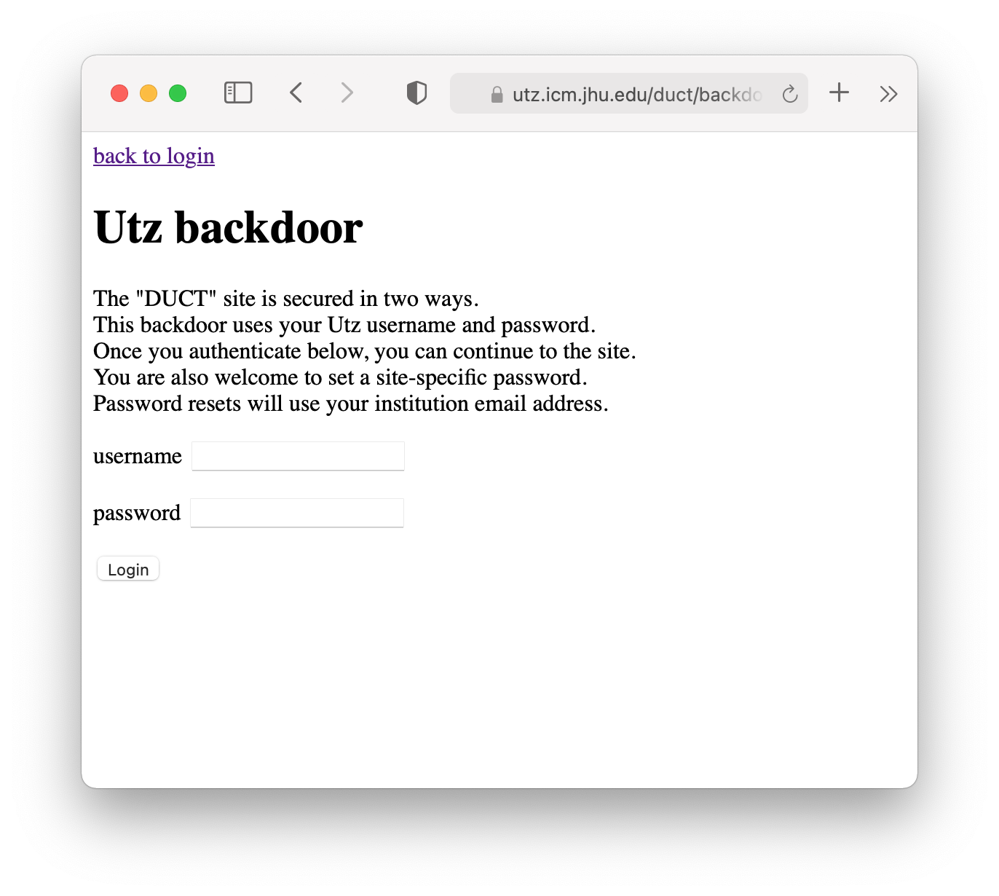

After you login with your University credentials you will have two options.

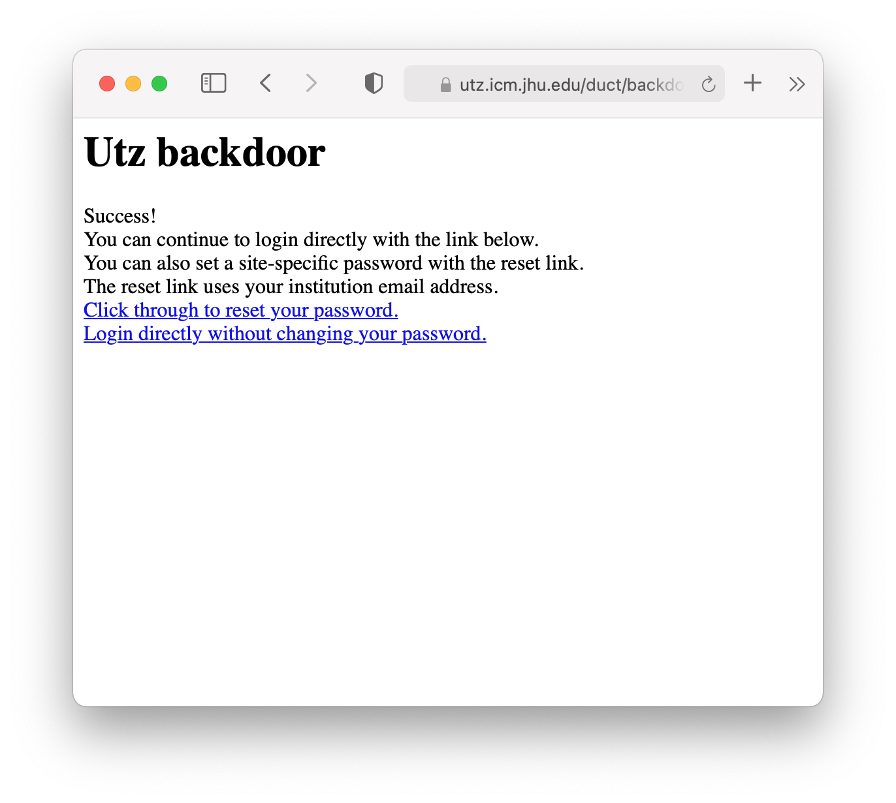

The easiest method is to "login directly without changing your password." This option will take you directly to the site. In the future you can continue to use your JHED ID as long as you have access to Utz.

If you "click through to reset your password," you will be taken to a page where you can set a specific password for this site. Your password will be associated with your University email using the *standard* format: `<JHED_ID>@jhu.edu` regardless of any other email aliases you might have.

External users who have left the University are welcome to help us annotate the data. Get in touch with the admin to receive an account.

After you login, you will see the main page.

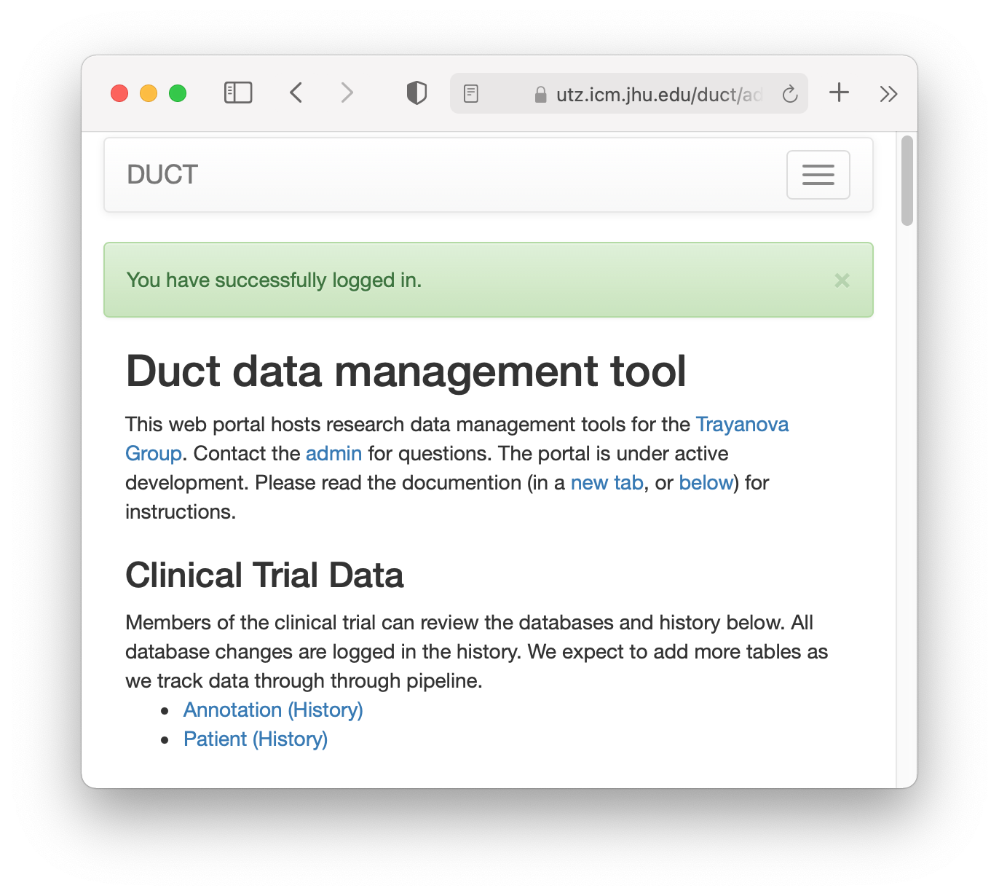

## 2. Review the categories

Before we assign a class (a.k.a. an annotation or mark or tag or category) our data with a, we must review the types of tags, which we call `DataClassKind`. Select this item from the dropdown menu pictured below.

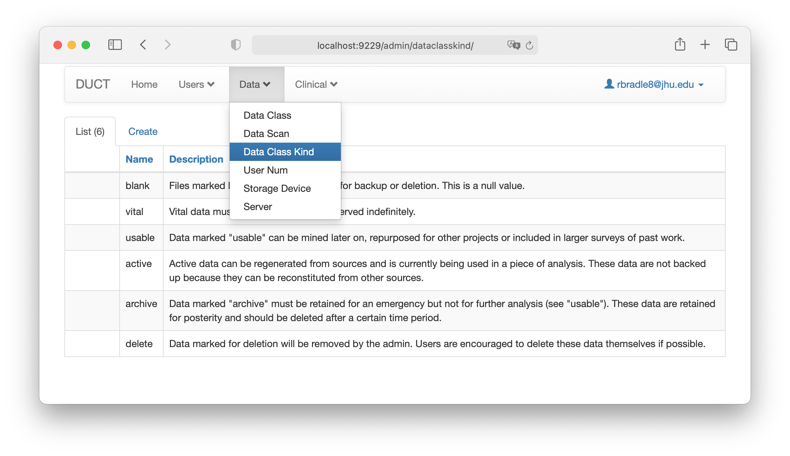

We have provided several different data classes. The most important is `vital` which indicates that these data should be backed up in a separate machine. We can add more classes if you want.

## 3. Select a scan

The program displays file "scans" which include all of the files on the storage systems. In order to annotate your data, you need to select a scan. Visit the `DataScan` item from the dropdown menu below.

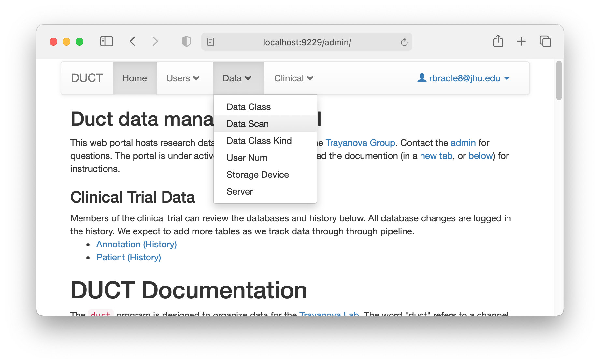

There are two kinds of scans.

1. Any scan marked `all-users` contains all of the data on the system. These files are very large and somewhat slow to navigate.
2. Scans with a `User` field below include files owned by a specific username.

You can search for a username with the search box. You are welcome to inspect other users' data because this is a shared system, and you *may need to mark another set of data that you do not own*. 

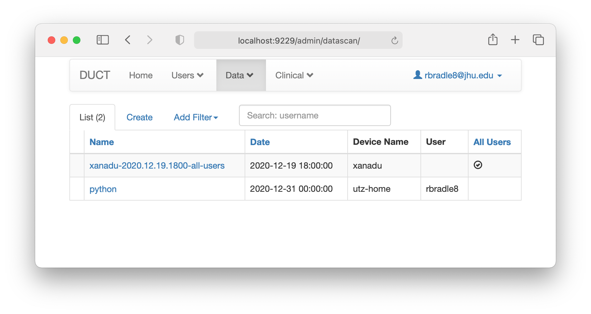

To use the scan, click the link under the name column. This will take you to the treemap.

## 4. Navigate the treemap

We use a [treemap](https://plotly.com/python/treemaps/) thanks to [Plotly](https://plotly.com) to navigate the data. The server provides a dynamic view of three levels of the file hieararchy. The entire file tree for one storage device takes up over 3GB of space and cannot be displayed at once in a browser. An example top-level treemap is pictured below.

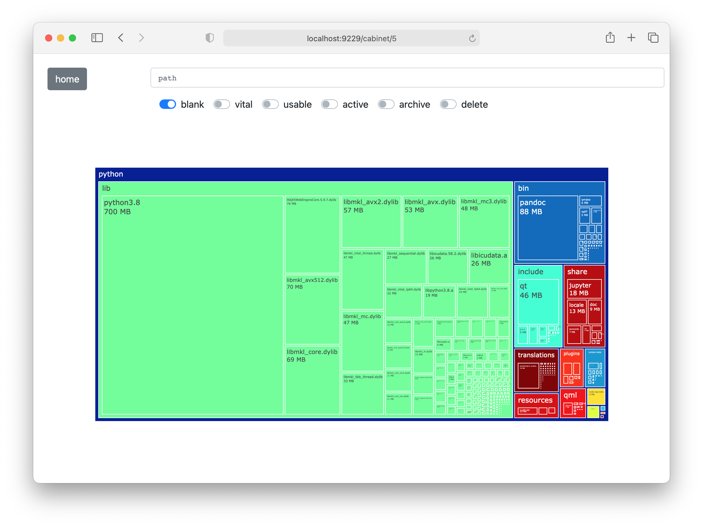

This interface has three parts:

1. A path bar at the top that tells you your location in the file tree after you start to navigate.
2. Toggle switches to select a `DataClass` for a particular path.
3. The treemap.

The treemap shows you three levels. In this example, the root path is `./python` at the highest level. The second level is depicted with colors. Each colored rectangle is a subfolder of the root, for example `./python/lib` in light green above. We use the coloring scheme to highlight the second level because the third level uses only rectangles that are nested inside the second. 

*The treemap renders the rectangles proportional to their size,* meaning that larger rectangles have a larger size. Each rectangle tells you the size in human-readable units as well.

If you click a rectangle, a loading animation will appear while we load the corresponding path. ***It may take a moment to load the data. This program is not optimized for speed.*** After you click a subfolder, the treemap will show you the root path in blue using pentagonal arrow signs. 

In the example below, we have navigated to `./python/include/qt`. This path is also presented in the path bar.

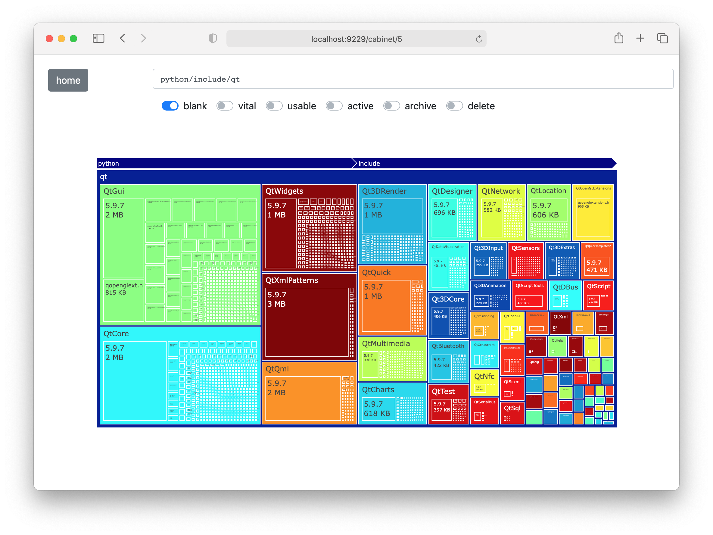

The current path is always the largest rectangle. The blue arrow items above it correspond to the parent folders. In the example below we have navigated seven levels into the file tree. The treemap shows both files and directories as rectangles. Once you have navigated to a specific path, you can click the toggle buttons to mark or annotate it. 

## 5. Annotate

Once you have navigated to a specific path, you can click the toggle buttons to mark or annotate it. In the example below, we have marked the path `./python/include/qt/Qt3DCore/5.9.7/Qt3DCore/private` as `vital` which means it will be backed up.

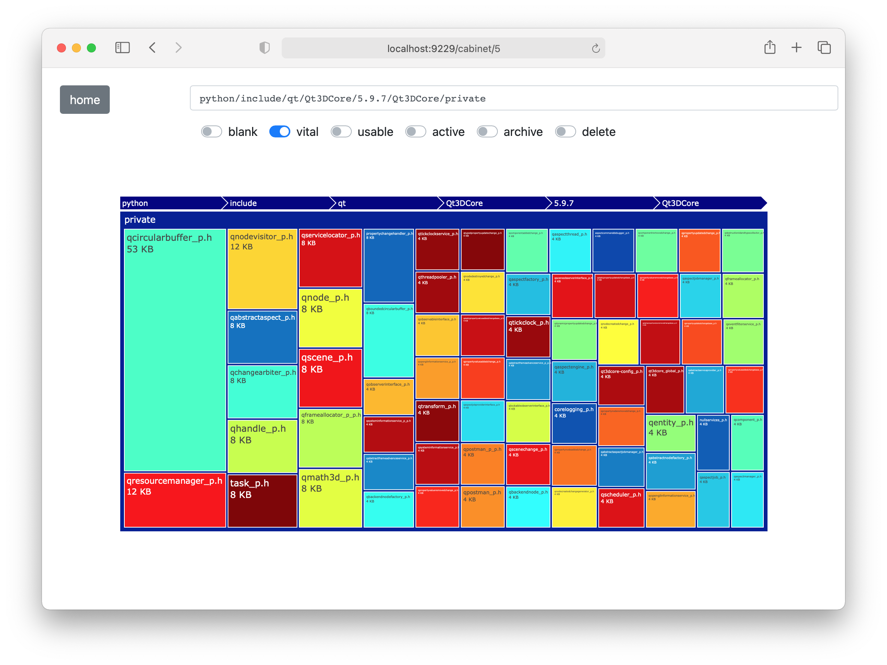

When we back up the data, everything contained within a specific path will be annotated with your selection. That is, the classes are recursive, and apply to all children of a particular path. Note that we will use the highest possible tag whenever there are collisions. Anything marked `vital` will be automatically backed up.

## 6. Review

You can review your annotations by clicking the `Data` menu and selecting the `DataClass` item. You can only see your annotations, but an admin will produce a comprehensive report of all the annotations for the group to review at a later date.

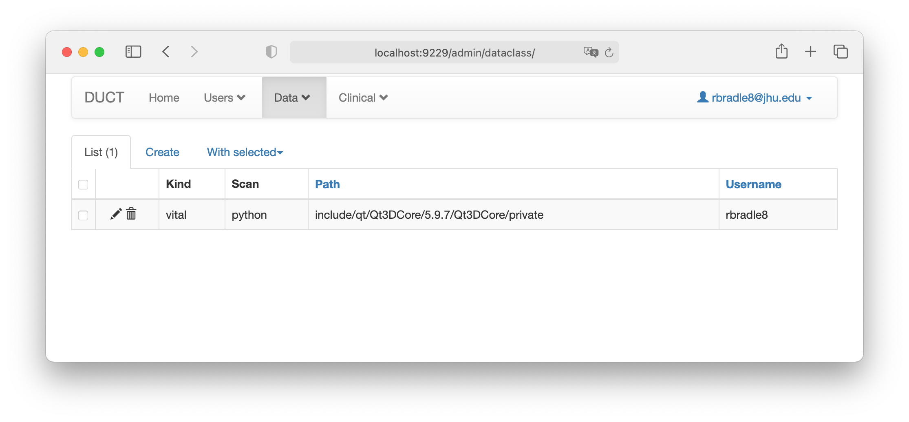

This is the final product for our application: the list of `DataClass` objects will tell the admins exactly which data is the most important so we can safeguard it in the future.

## Questions and future development

Feedback and feature ideas are welcome. If you already have a large batch of directories to back up, please let me know and I will add a batch annotation feature. If you have any difficulty using this program, please get in touch.